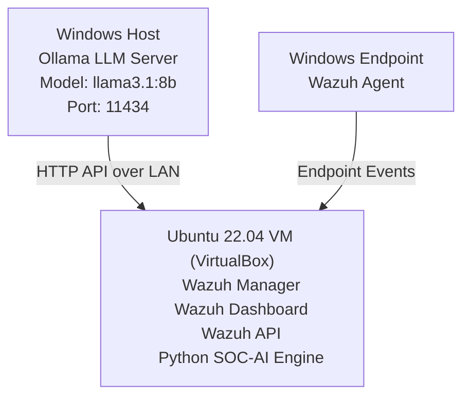

# SOC Lab - Wazuh SIEM and XDR Integrated with Local LLM

A home lab Security Operations Center built with Wazuh SIEM/XDR and a locally running LLM (Ollama + Llama 3.1 8B) for AI-assisted security log analysis and incident response.

## Table of Contents

- [Overview](#overview)
- [Architecture](#architecture)
- [Features](#features)
- [Tools and Technologies](#tools-and-technologies)
- [Setup Guide](#setup-guide)
- [Sample Output](#sample-output)
- [Challenges and Solutions](#challenges-and-solutions)
- [Skills Demonstrated](#skills-demonstrated)

## Overview

SOCAI is a local AI-powered SOC (Security Operations Center) assistant that integrates Wazuh SIEM for log collection and alerting, a Windows endpoint Wazuh agent for monitoring, Ollama running Llama 3.1 8B as a fully local LLM, a Python automation engine, and cross-machine API communication between Ubuntu and Windows over LAN.

The system converts raw Wazuh security alerts into structured SOC analyst insights covering severity classification, attack interpretation, MITRE ATT&CK mapping, and recommended remediation steps.

## Architecture

## Features

**Real-time Security Monitoring**
- File integrity detection via Wazuh FIM
- Windows event log analysis
- Agent-based telemetry from endpoint

**AI SOC Analyst**
- Converts raw Wazuh alerts into plain-language explanations
- Maps detected activity to MITRE ATT&CK techniques
- Provides step-by-step remediation guidance

**Distributed AI Architecture**
- Windows host runs LLM inference via Ollama
- Ubuntu VM runs SIEM and Python orchestration
- Communication via REST API over bridged LAN

## Tools and Technologies

**Security Stack**
| Tool | Purpose |
|------|---------|
| Wazuh SIEM 4.x | Log collection, alerting, dashboards |
| File Integrity Monitoring (FIM) | Real-time file change detection |
| Syscollector and Rootcheck | System inventory and rootkit detection |
| Windows Event Logging | Endpoint event source |

**AI Stack**
| Tool | Purpose |
|------|---------|
| Ollama | Local LLM runtime |
| Llama 3.1 8B (Q4_K_M) | Quantized model for security analysis |
| REST API | Inference communication between machines |

**Infrastructure**
| Component | Details |
|-----------|---------|
| Hypervisor | Oracle VirtualBox |
| VM OS | Ubuntu Server 22.04 |
| Host OS | Windows 10 |
| Networking | Bridged Adapter |

**Development**
- Python 3
- Requests library
- Bash scripting
- PowerShell (Windows configuration)

## Setup Guide

See **[SETUP.md](SETUP.md)** for the full step-by-step walkthrough.

High-level steps:
1. Set up Ubuntu VM in VirtualBox with a bridged network adapter
2. Install Wazuh Manager and Dashboard on Ubuntu
3. Install Wazuh Agent on the Windows host
4. Install Ollama on Windows and expose it over LAN
5. Configure FIM in the Wazuh ossec.conf file
6. Run the Python SOC-AI engine from Ubuntu

## Sample Output

See **[sample-output.md](sample-output.md)** for a real example of the LLM analyzing a Wazuh brute-force alert, including severity rating, MITRE ATT&CK mapping, and recommended actions.

## Challenges and Solutions

| Issue | Cause | Solution |
|-------|-------|---------|
| Ollama only reachable on localhost | Default binding to 127.0.0.1 | Set `OLLAMA_HOST=0.0.0.0:11434` |
| Firewall blocking VM access to Ollama | No inbound rule for port 11434 | Created inbound firewall rule via PowerShell |
| Ollama reverting to localhost on restart | Auto-start launcher overriding env var | Killed background launcher, disabled auto-start, enforced manual control |
| VirtualBox IP confusion | Misidentified IP ranges | Confirmed Windows at 192.168.0.10, Ubuntu at 192.168.0.11 |
| pip install blocked on Ubuntu | PEP 668 externally managed environment | Used a Python virtual environment |

## Skills Demonstrated

- SIEM architecture design
- Endpoint security monitoring
- LLM integration for cybersecurity
- REST API engineering
- Cross-platform networking
- Incident analysis automation
- SOC workflow simulation

This project demonstrates a fully functional AI-assisted Security Operations Center prototype, combining real-world SIEM tooling with local LLM inference to simulate intelligent cybersecurity analysis without relying on any external cloud services.
